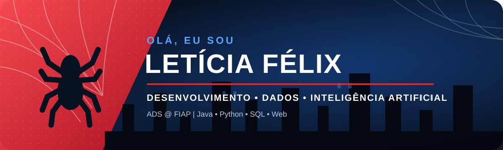

  

  

  
  
  

## 🕸️ Sobre mim

Sou estudante de **Análise e Desenvolvimento de Sistemas na FIAP**, em busca de uma oportunidade de estágio para aplicar meus conhecimentos, colaborar com equipes e evoluir profissionalmente.

Tenho interesse em **desenvolvimento de software, inteligência artificial, bancos de dados e aplicações web**. Em meus projetos acadêmicos, participo da construção de soluções desde a definição do problema até a implementação e apresentação do produto.

- 🎓 Análise e Desenvolvimento de Sistemas — FIAP
- 📍 São Paulo, Brasil
- 💼 Em busca de estágio em Tecnologia
- 🧠 Estudando Java, Python, SQL, IA, desenvolvimento web e engenharia de software
- 🕷️ Minha motivação: usar tecnologia com responsabilidade para resolver problemas reais

## 🦸 Competências técnicas

### Linguagens e desenvolvimento

  

- **Java:** orientação a objetos, domínio de negócio e desenvolvimento de aplicações.
- **Python:** lógica de programação, automação e fundamentos de análise de dados.
- **Front-end:** HTML, CSS, JavaScript, responsividade e organização de interfaces.
- **Inteligência Artificial e Chatbots:** fundamentos de IA, assistentes virtuais e fluxos conversacionais.

### Dados, engenharia e negócios

- **Banco de dados:** modelagem relacional, SQL e Oracle SQL Developer.
- **Engenharia de software:** requisitos, modelagem, documentação e organização de projetos.
- **Modelagem de negócios:** identificação de problemas, proposta de valor e soluções alinhadas às necessidades dos usuários.

### Ferramentas e versionamento

  

`Git` · `GitHub` · `VS Code` · `IntelliJ IDEA` · `Oracle SQL Developer`

## 🕷️ Projetos em destaque

<table>
  <tr>
    <td width="50%" valign="top">
      <h3 align="center">🚆 LocalLead</h3>
      

        Solução criada para auxiliar usuários do transporte ferroviário urbano por meio de previsões inteligentes sobre mobilidade, combinando conceitos de inteligência artificial, análise climática e inteligência espacial.
      

      
<strong>Minha contribuição:</strong> correções de conteúdo e ortografia, ajustes no menu e otimização das imagens das páginas App, Sobre e Solução.

      
<a href="https://github.com/LeticiaFelix18/LocalLead"><strong>Explorar o projeto →</strong></a>

    </td>
    <td width="50%" valign="top">
      <h3 align="center">🌱 Soulie</h3>
      

        Assistente virtual gamificada desenvolvida para aumentar o engajamento dos usuários e incentivar hábitos sustentáveis de maneira leve, interativa e acessível.
      

      
<strong>Minha contribuição:</strong> ajustes responsivos com media queries, alinhamento de componentes, melhorias na trajetória da solução, dimensões do avatar e identidade visual da página inicial.

      
<a href="https://github.com/LeticiaFelix18/soulie"><strong>Explorar o projeto →</strong></a>

    </td>
  </tr>
</table>

  
<strong>🧭 O que estou estudando na FIAP</strong>

   

- **Artificial Intelligence & Chatbot:** IA, assistentes virtuais e fluxos conversacionais.
- **Building Relational Database:** modelagem relacional e SQL.
- **Computational Thinking Using Python:** lógica e programação em Python.
- **Domain Driven Design Using Java:** Java, orientação a objetos e regras de negócio.
- **Front End Design Engineering:** HTML, CSS, JavaScript e responsividade.
- **Software Engineering and Business Model:** requisitos, documentação, proposta de valor e modelagem de soluções.

## 📊 Atividade no GitHub

  
  

  

<picture>
  <source media="(prefers-color-scheme: dark)" srcset="https://raw.githubusercontent.com/LeticiaFelix18/LeticiaFelix18/output/github-contribution-grid-snake-dark.svg" />
  <source media="(prefers-color-scheme: light)" srcset="https://raw.githubusercontent.com/LeticiaFelix18/LeticiaFelix18/output/github-contribution-grid-snake.svg" />
  
</picture>

---

  <strong>🕸️ Grandes soluções começam com a coragem de dar o primeiro passo.</strong>

